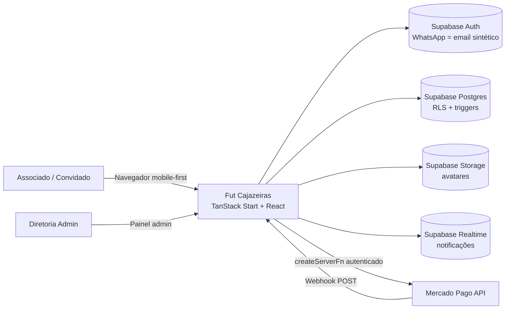
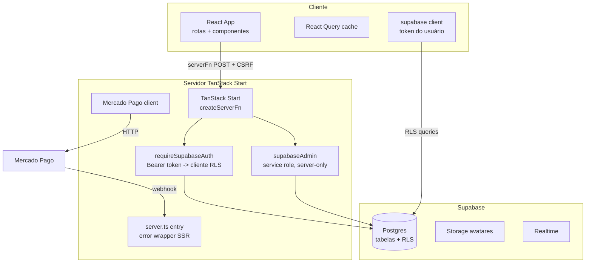
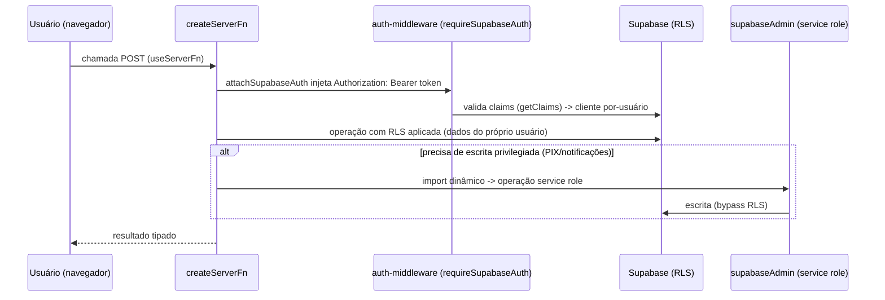

# Fut Cajazeiras — Documentação Técnica Completa

> **Objetivo:** servir como especificação técnica completa para **recriar o sistema do zero** com qualquer LLM/equipe (Gemini, ChatGPT, Claude, DeepSeek etc.), reproduzindo comportamento, modelo de dados, segurança e visual.

**Sistema:** plataforma de gestão de um "baba" (pelada/futebol amador) — confirmação de presença, convidados, pagamentos por PIX, sorteio de times, ranking e punições.

---

## Sumário

| #   | Documento                                                          | Conteúdo                                                                                                                             |
| --- | ------------------------------------------------------------------ | ------------------------------------------------------------------------------------------------------------------------------------ |
| —   | **[README (este arquivo)](README.md)**                             | Visão geral, stack, arquitetura, diagramas visuais                                                                                   |
| 1   | **[01-banco-de-dados.md](01-banco-de-dados.md)**                   | Schema PostgreSQL completo: enums, tabelas, visões, funções, triggers, RLS, migrations                                               |
| 2   | **[02-logica-de-negocio.md](02-logica-de-negocio.md)**             | Regras de negócio: janela da lista, check-in GPS, sorteio, convidados, associação, mensalidade/PIX, suspensões, gamificação, ranking |
| 3   | **[03-backend-e-integracoes.md](03-backend-e-integracoes.md)**     | Server functions, auth, integração Mercado Pago PIX (webhook), fluxos end-to-end                                                     |
| 4   | **[04-frontend.md](04-frontend.md)**                               | Rotas, layout, inventário de componentes, design system, padrões de UI                                                               |
| 5   | **[05-seguranca.md](05-seguranca.md)**                             | Modelo RLS, SECURITY DEFINER, grants, CSRF, modelo de confiança do webhook                                                           |
| 6   | **[06-configuracao-e-deploy.md](06-configuracao-e-deploy.md)**     | Variáveis de ambiente, build, Supabase config, testes, versionamento                                                                 |
| 7   | **[07-recriacao-passo-a-passo.md](07-recriacao-passo-a-passo.md)** | Receita passo a passo para recriar o sistema com outra LLM                                                                           |

---

## 1. Visão geral

O **Fut Cajazeiras** é um app **mobile-first, dark-only** para gerenciar um baba semanal:

- **Associados** confirmam presença na lista (que abre 22h do dia anterior e fecha 3h antes do jogo), pagam mensalidade por PIX, fazem check-in no campo por GPS (ordem de chegada) e participam do sorteio de times.
- **Convidados** entram via um associado (anfitrião), com aprovação da diretoria para novos, e pagam uma diária por PIX.
- **Diretoria (admin)** agenda babas, controla financeiro, faz o sorteio (Aleatório / Ordem de chegada / BAxVI), lança resultados e estatísticas, gerencia cargos, aplica/remove punições, ajusta valores e a política de suspensões.
- **Gamificação completa:** XP automático (+10 presença, +5 gol, +3 assistência), níveis com bônus no OVR, conquistas com destaque (até 3), badges de destaque mensal (top 3 em gols/assistências/pênaltis/cartões) e **cartinhas de jogador estilo EA FC** (OVR + RIT/FIN/PAS/DRI/DEF/FÍS) com temas Bronze/Prata/Ouro e especiais (TOTW, Lenda do Baba, Paredão), exportáveis como PNG.
- **Punições automáticas:** cartão vermelho e faltas (3 em 5 babas, tudo configurável) geram suspensão automática do próximo baba + notificação.

**Público:** associados e convidados usam a mesma UI; a diretoria tem um painel admin adicional.

---

## 2. Stack tecnológica

| Camada        | Tecnologia                                 | Versão/Nota                              |
| ------------- | ------------------------------------------ | ---------------------------------------- |
| Runtime       | Node.js (TS com type-stripping p/ scripts) | Node 26 no dev                           |
| Framework     | **TanStack Start** (React 19 + Vite)       | Roteamento file-based + server functions |
| Roteador      | TanStack Router                            | `routeTree.gen.ts` gerado                |
| Dados         | TanStack React Query                       | `queryOptions` centralizados             |
| Backend/Banco | **Supabase** (PostgreSQL 15+)              | Auth, Postgres, Storage, Realtime        |
| UI            | React + shadcn/ui + Tailwind CSS v4        | Tema dark custom (oklch)                 |
| Ícones        | lucide-react                               | —                                        |
| Datas         | date-fns (locale pt-BR)                    | Fuso America/Bahia (UTC-3)               |
| Pagamentos    | **Mercado Pago — PIX**                     | Webhook + API v1 payments                |
| Formulários   | react-hook-form + zod (parcial)            | —                                        |
| Gráficos      | recharts                                   | (presente; pouco usado)                  |
| Toasts        | sonner                                     | `Toaster top-center richColors`          |

**Build:** `@lovable.dev/vite-tanstack-config` (inclui TanStack devtools, Vite React, Tailwind, alias `@`, Nitro/Cloudflare como alvo de build, injeção de env `VITE_*`). Não adicionar plugins duplicados manualmente.

---

## 3. Arquitetura (diagramas visuais)

### 3.1 Contexto do sistema



### 3.2 Arquitetura de contêineres (TanStack Start)



### 3.3 Fluxo de uma chamada autenticada (server function)



### 3.4 Estrutura de pastas

```
futcajazeiras/
├─ package.json, vite.config.ts, bunfig.toml, tsconfig.json, eslint.config.js
├─ supabase/
│  ├─ config.toml            # project_id qbkhnhxhshgwjxbhxdmm
│  └─ migrations/            # 35 migrations (ordem cronológica = schema)
├─ public/
│  ├─ llms.txt, robots.txt
│  └─ fut-cajazeiras-escudo.png.asset.json
└─ src/
   ├─ router.tsx             # createRouter + QueryClient
   ├─ routeTree.gen.ts       # GERADO — não editar
   ├─ server.ts              # entry SSR + captura de erro catastrófico
   ├─ start.ts               # createStart + middlewares (error, CSRF)
   ├─ styles.css             # design system (tokens oklch, card-premium/vip)
   ├─ assets/
   ├─ components/
   │  ├─ ui/                 # shadcn (48 primitivos)
   │  └─ *.tsx               # BottomNav, BadgeDestaque, RankingMensal, ChegadaGps,
   │                         # PlayerCard, CartinhaModal, GerenciadorConquistas, MicroConquistas,
   │                         # NomeJogadorCartinha, ...
   ├─ hooks/
   ├─ integrations/supabase/
   │  ├─ client.ts           # supabase (browser/SSR)
   │  ├─ client.server.ts    # supabaseAdmin (service role)
   │  ├─ auth-attacher.ts    # attachSupabaseAuth
   │  ├─ auth-middleware.ts  # requireSupabaseAuth
   │  └─ types.ts            # tipos gerados do banco
   ├─ lib/
   │  ├─ babaQueries.ts      # TODAS as React Query queries + constantes
   │  ├─ sorteio.ts          # algoritmos de sorteio
   │  ├─ gamificacao.ts      # badges de destaque + XP/níveis/conquistas
   │  ├─ cartinha.ts         # lógica das cartinhas (atributos, OVR, temas)
   │  ├─ cartinhaExport.ts   # exporta cartinha como PNG (html-to-image)
   │  ├─ associado.ts, telefone.ts, utils.ts
   │  ├─ pagamentos.functions.ts, pagamentos.server.ts
   │  ├─ mercadopago.server.ts
   │  ├─ convidados.functions.ts
   │  └─ error-capture.ts, error-page.ts, lovable-error-reporting.ts
   └─ routes/
      ├─ __root.tsx, index.tsx (landing), auth.tsx
      ├─ sitemap[.]xml.ts
      ├─ api/public/mercadopago-webhook.ts
      └─ _authenticated/ (inicio, baba, perfil, pagamentos, ajuda)
         └─ admin/ (index=Sessões, sorteio, resultados, estatisticas, financeiro, usuarios, cargos, ajuda)
```

---

## 4. Conceitos centrais do domínio

| Conceito                   | Definição                                                                                                                                                                                            |
| -------------------------- | ---------------------------------------------------------------------------------------------------------------------------------------------------------------------------------------------------- |
| **Baba / Sessão**          | `sessoes_baba` — jogo agendado com data/horário, local, GPS (lat/lng/raio), janela de lista (`abertura_lista`, `fechamento_lista`), trava manual (`esta_fechado`) e visibilidade da lista de chegada |
| **Presença**               | `presencas` — assinatura na lista. Uma linha = presença do associado **ou** de um convidado que ele leva                                                                                             |
| **Convidado**              | Pessoa não-associada levada por um anfitrião; paga diária; novos passam por aprovação da diretoria                                                                                                   |
| **Mensalidade**            | `mensalidades` — cobrança mensal por associado, vence dia 10, paga via PIX                                                                                                                           |
| **Sorteio**                | Algoritmo que monta os times (6 ou 7) a partir da lista; ninguém fica de fora                                                                                                                        |
| **Ranking**                | View `ranking_mensal` agregando estatísticas por mês; categorias: gols, assistências, pênaltis defendidos, cartões, vitórias/derrotas/empates                                                        |
| **Destaque/Gamificação**   | Badge de top-3 mensal em cada categoria (🥇🥈🥉 + ⚽🅰️🧤🟥)                                                                                                                                          |
| **XP/Níveis**              | `perfis.xp_atual`/`nivel_atual` atualizados por triggers (`concede_xp`): +10 presença, +5 gol, +3 assistência; nível por fórmula 100·n·(n−1)/2                                                       |
| **Conquistas**             | `conquistas` (catálogo) + `usuario_conquistas` (vínculo, `em_destaque`/`ordem_destaque`, máx. 3 destaques); desbloqueio automático por `verifica_conquistas`                                         |
| **Cartinha**               | `perfis.ovr` + `stat_ritmo/finalizacao/passe/drible/defesa/fisico` + `tema_carta`; calculados por `calcula_cartinha` a partir do desempenho real                                                     |
| **Suspensão**              | `suspensoes` — bloqueio do check-in em um baba futuro; origem: `diretoria`, `cartao_vermelho`, `faltas`                                                                                              |
| **Política de suspensões** | Parâmetros em `configuracoes`: limite de faltas, janela, duração das suspensões (0 = desliga)                                                                                                        |

---

## 5. Como navegar nos documentos

1. Comece pelo **[01-banco-de-dados.md](01-banco-de-dados.md)** para entender o schema (é a fonte de verdade do comportamento).
2. Leia **[02-logica-de-negocio.md](02-logica-de-negocio.md)** para as regras (janela, check-in, sorteio, convidados, punições).
3. Veja **[03-backend-e-integracoes.md](03-backend-e-integracoes.md)** para os fluxos PIX e server functions.
4. **[04-frontend.md](04-frontend.md)** documenta rotas e componentes.
5. **[05-seguranca.md](05-seguranca.md)** e **[06-configuracao-e-deploy.md](06-configuracao-e-deploy.md)** cobrem segurança e ambiente.
6. Para recriar do zero com outra LLM, siga **[07-recriacao-passo-a-passo.md](07-recriacao-passo-a-passo.md)**.

---

_Documentação gerada a partir da análise estática do código-fonte e das 35 migrations. Fuso padrão: America/Bahia (UTC-3, sem DST), também referenciado como America/Fortaleza._
